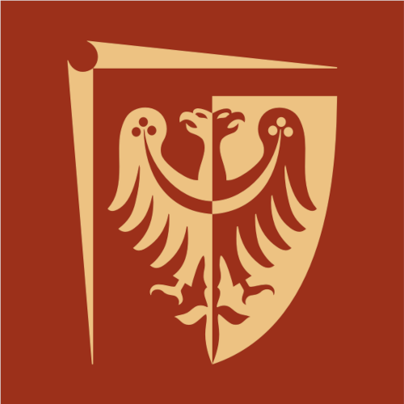

# TCM Hob Inspector

## General information

Multifunctional system for the automatic inspection of gear hobbing tools, featuring:
* **AI-based image processing system**
* Dash based **interactive application**
* **SQL database** for storing the results of the performed scans

## Machine learning solutions

- **Detectron2 models** based on the ResNET architecture
- Supervised learning using **custom datasets**
- Annotations with artifacts saved in .json format, compatible with **LabelMe software**
- System for **semi-automatic datasets creation**
- Custom python scripts for training and evaluation of AI models 
- Model comparison and performance tracking using **Neptune.AI**

## Technologies used

- Python 3.11
- Detectron2 v0.6
- PyTorch 2.0
- NVIDIA CUDA 11.8

## Project Status

Project is: _in progress_ 

## Experiments tracking

Neptune [click here](https://app.neptune.ai/kacper-marciniak/)

## Organisations involved in the project development

<table>
  <tr>
    <th><a href="https://pwr.edu.pl/">Wrocław University of Science and Technology</a></th>
    <th><a href="https://mvlab.pl/">Machine Vision Laboratory</a></th>
    <th><a href="https://www.tcm-international.com/">TCM International</a></th>
  </tr>
  <tr>
    <td width=33%>

</td>
    <td width=33%>

</td>
    <td width=33%>

</td>
  </tr>
</table>

