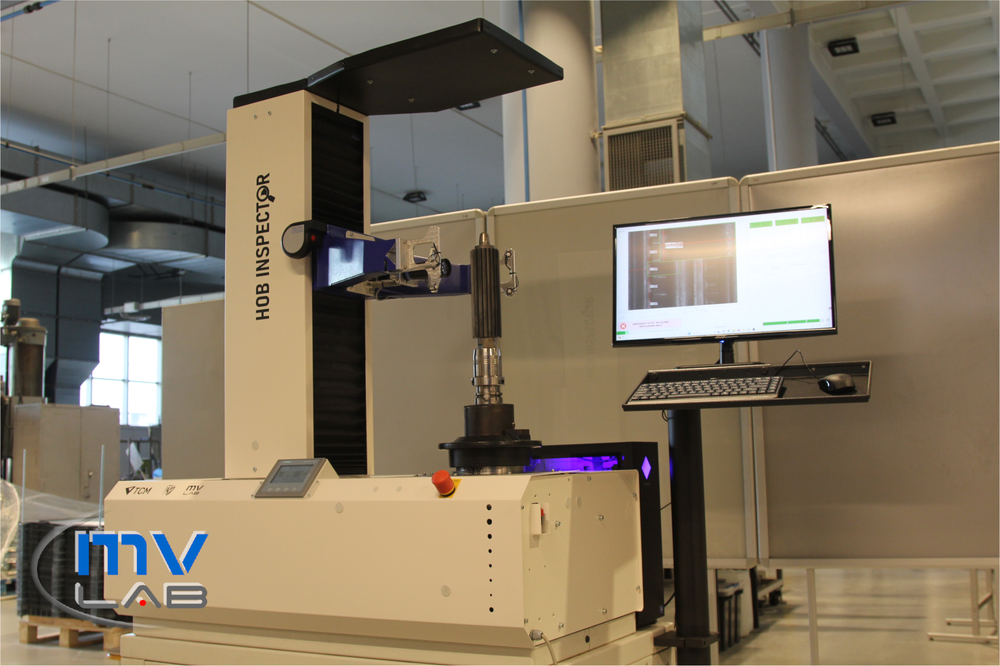
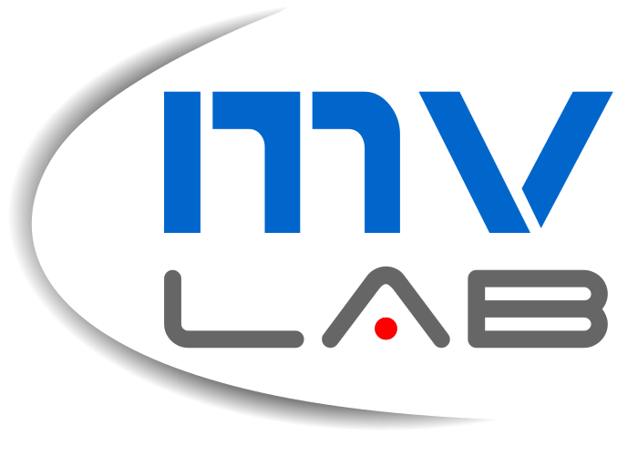

# TCM Hob Inspector

## Overview

The **TCM Hob Inspector** is an advanced, multifunctional system designed for the automatic inspection of gear hobbing tools. It employs advanced ML technologies to enhance efficiency, precision, and cost-effectiveness in tool maintenance processes.

### Key Features:

- **Hybrid classic and ML-driven image processing**:
  - Segmentation of tooth rake faces and surface anomalies using ML models.
  - Segmentation of flank wear with classic machine vision methods.
- **Cost optimization module**:
  - Analyses tool state and suggests optimal grinding method to maximize lifecycle profitability.
- **Interactive Dash application**:
  - Enables result visualization, selection of machining parameters, and generation of detailed tool scan reports.
- **SQL database**:
  - Secure storage for scan results and analysis data.

---

## Machine Learning Solutions

- Dual inference using **YOLOv8 instance segmentation model** and classic machine vision methods
- Supervised learning with **custom datasets**
- Annotations with artifacts saved in `.json` format, compatible with **LabelMe software**
- **Semi-automatic dataset creation** system
- Data collection during the production cycle for model development
- Custom Python scripts for training and evaluating ML models

---

## Visualization and Reporting
The project includes a powerful visualization application to analyze and interpret inspection results effectively:

### Examples:

**Hob Wear Map**

**Automatic Report Generation**

---

## Video Demonstration

Learn more about the **Hob Inspector** by watching our demonstration video on YouTube.

  

---

---

## Collaborators

  <table style="background-color:white">
    <tr>
      <th><a href="https://pwr.edu.pl/">Wrocław University of Science and Technology</a></th>
      <th><a href="https://mvlab.pl/">Machine Vision Laboratory</a></th>
      <th><a href="https://www.tcm-international.com/">TCM International</a></th>
    </tr>
    <tr>
      <td width="33%">

</td>
      <td width="33%">

</td>
      <td width="33%">

</td>
    </tr>
  </table>

